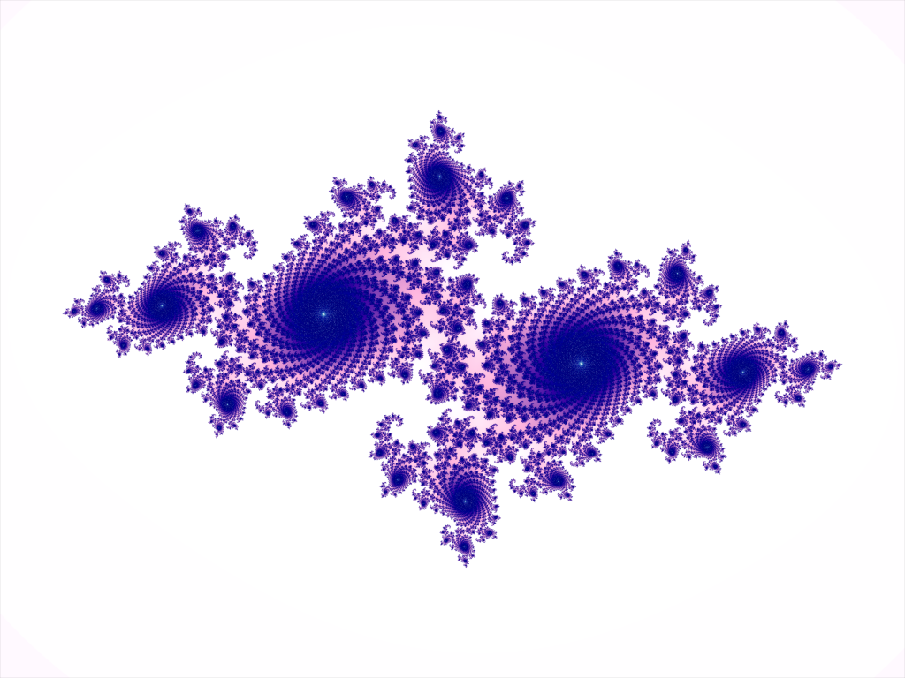

# Julia Set Visualizer

A real-time, interactive Julia set renderer built with OpenGL, GLFW, and GLEW in C++. All fractal math runs in a GLSL fragment shader on the GPU — one shader invocation per pixel, every frame.



## Controls 

| Input | Action |
|---|---|
| Mouse move | Change the Julia constant `c` (real + imaginary parts) |
| `Space` | Lock / unlock `c` at its current value |
| Scroll wheel | Zoom in / out |
| `W A S D` / Arrow keys | Pan around |
| `Esc` | Close |

## Features

- **GPU-accelerated** — fragment shader runs on the dedicated GPU (NVIDIA Optimus forced via `NvOptimusEnablement`)
- **Smooth coloring** — normalized iteration count removes harsh color bands at fractal boundaries
- **Animated synthwave palette** — cosine-based RGB palette slowly cycles over time
- **Dynamic iteration limit** — max iterations scale logarithmically with zoom depth for sharp detail without wasted computation (range: 256 – 2048)
- **Aspect-correct view** — complex plane is stretched to match the window ratio so circles stay circular
- **VSync on** — capped to monitor refresh rate (tested at 165 Hz)

## How It Works

The CPU draws a single fullscreen quad (two triangles). For every pixel, the fragment shader:

1. Maps the pixel's screen position to a point `z` in the complex plane, applying zoom and pan
2. Iterates `z = z² + c` up to `maxIter` times, stopping when `|z| > 2`
3. Uses the smooth escape-time formula to compute a continuous (non-banded) color value
4. Passes that value through a cosine palette to produce the final RGB color

The Julia constant `c` is a uniform uploaded from the CPU every frame based on mouse position.

## Build Requirements

- Windows (uses `__declspec(dllexport)` for NVIDIA Optimus)
- Visual Studio (tested with VS 2022)
- OpenGL 3.3+ capable GPU
- [GLFW 3](https://www.glfw.org/)
- [GLEW](https://glew.sourceforge.net/)

## Visual Studio Setup

### Include Directories
`Project Properties → C/C++ → General → Additional Include Directories`
```
C:\path\to\GLFW\include
C:\path\to\GLEW\include
```

### Linker Dependencies
`Project Properties → Linker → Input → Additional Dependencies`
```
glfw3.lib
opengl32.lib
glew32s.lib
User32.lib
Gdi32.lib
Shell32.lib
Winmm.lib
```

### Preprocessor Definition
`Project Properties → C/C++ → Preprocessor → Preprocessor Definitions`
```
GLEW_STATIC
```

### Build Target
Set to **x64** (Release or Debug).

## Project Structure

```
julia_set/
└── src/
    └── Application.cpp   ← entire project: shaders, input, render loop
```

Everything — vertex shader, fragment shader, input handling, and the render loop — lives in one file for readability. Shaders are inline raw string literals (`R"(...)"`) alongside the C++ code that uses them.

## Key References

| Topic | Resource |
|---|---|
| OpenGL functions | [docs.gl](https://docs.gl) |
| GLSL built-ins | [Khronos GLSL 3.30 spec](https://registry.khronos.org/OpenGL/specs/gl/GLSLangSpec.3.30.pdf) |
| GLFW input / window | [glfw.org/docs/latest](https://www.glfw.org/docs/latest/) |
| OpenGL concepts | [learnopengl.com](https://learnopengl.com) |
| Cosine palettes | [Inigo Quilez — palettes](https://iquilezles.org/articles/palettes/) |
